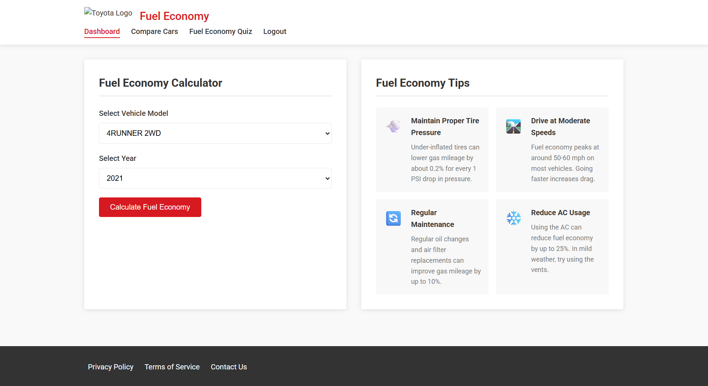
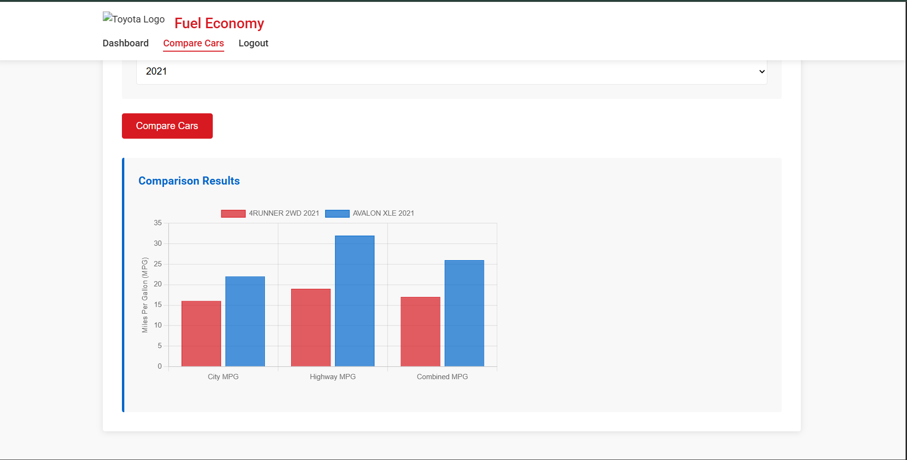
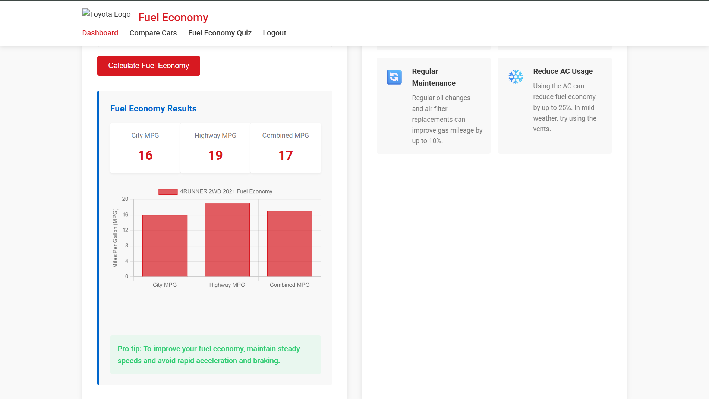

# Toyota Fuel Economy Analyzer (Full-Stack Web App)
### Dashboard

### Comparison

### Charts

A full-stack web application that allows users to explore and compare fuel economy data across Toyota vehicles.

## Features
- View fuel economy (City, Highway, Combined MPG)
- Filter by model and year
- Compare up to 3 vehicles side-by-side
- Interactive charts using Chart.js
- Login system and multi-page UI

## Tech Stack
- Backend: Node.js, Express.js
- Frontend: HTML, CSS, JavaScript
- Data: CSV-based dataset (431 vehicles)
- Visualization: Chart.js

## API Endpoints

- GET /api/vehicles → Fetch all vehicle data
- GET /api/vehicles/:id → Fetch specific vehicle details

## Dataset
- 431 vehicle records (2021–2025)
- 106 unique Toyota models
- Average MPG: 28.68

## How to Run
1. Clone the repository
2. Install dependencies:
npm install
3. Start server:
node server.js
4. Open in browser:
http://localhost:3000

## About
This project was initially conceptualized during a hackathon and later fully developed independently to analyze and visualize vehicle fuel efficiency data.

## Skills Demonstrated

- REST API development
- Frontend-backend integration
- Data parsing from CSV
- Data visualization using Chart.js
- Full-stack application development
